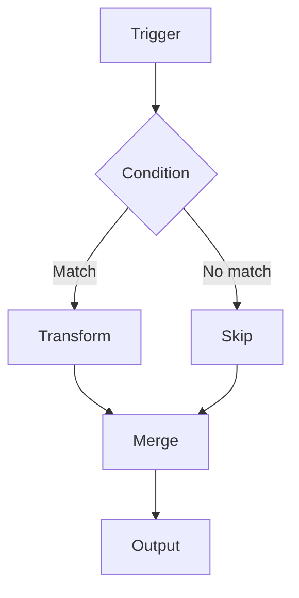

How the product is organized and how to build with it day to day.

## Projects

Projects are the unit of work. Each one carries its own members, integrations, and automation rules, so permissions and configuration never leak between them.

<Steps>
  <Step title="Create a project" icon="plus">
    From the dashboard, choose **New project**, give it a name, and pick the members who need access.
  </Step>

  <Step title="Configure integrations" icon="plug">
    Attach the connectors this project needs. Integrations are scoped per project, not per workspace.
  </Step>

  <Step title="Archive or restore" icon="archive">
    Archiving hides a project without deleting data. Restore it at any time from **Settings → Archived**.
  </Step>
</Steps>

## Workflows

A workflow is a directed graph of nodes. Runs enter at a trigger, flow through transforms, and end at one or more outputs.

### Conditions and branches

A condition node splits the run into branches that are evaluated top to bottom. The first match wins, and remaining branches are skipped.

Branches rejoin at a merge node. By default a merge waits for every inbound path to settle. Set it to first-arrival when you want the fastest branch to continue immediately.

<Callout kind="alert">
  A branch that never resolves will hold a wait-for-all merge open until the run times out. Give every branch a terminal path.
</Callout>

## Editor

<Tabs>
  <Tab title="Canvas" icon="layout-dashboard">
    Drag nodes from the palette onto the canvas. Connect them by dragging from an output port to an input port.
  </Tab>

  <Tab title="Inspector" icon="settings">
    Select any node to edit its configuration in the right panel. Changes apply to the draft until you publish.
  </Tab>

  <Tab title="Runs" icon="play">
    The runs tab replays past executions node by node, with the payload at each step.
  </Tab>
</Tabs>
